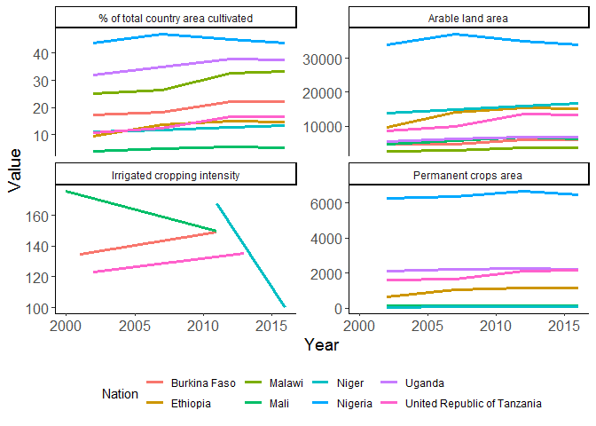
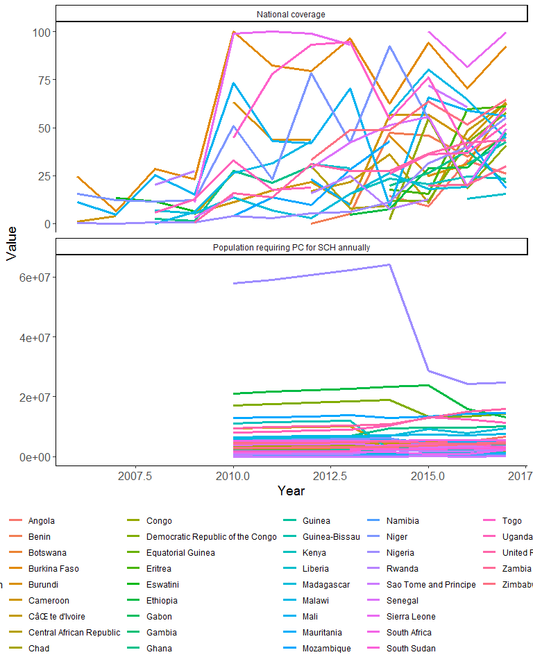
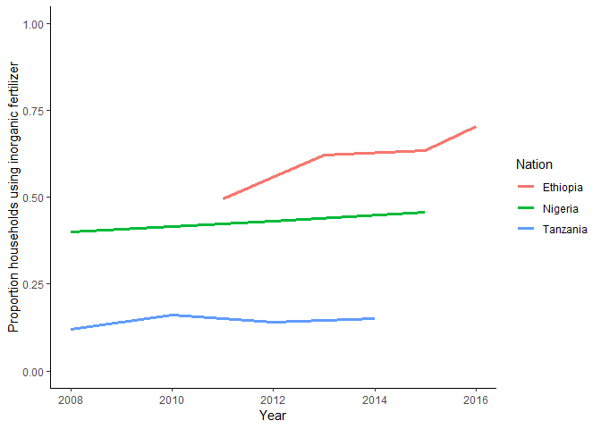

AgroSchisto Datasets
================

AQUASTAT
========

``` r
aquastat <- load_csv_from_googledrive("1TXFvEoVOfih4zbdHrRQXZM4ZcVKP3Z6n")

unique(aquastat$`Variable Name`)
```

    ##  [1] "Total area of the country (excl. coastal waters)"               
    ##  [2] "Arable land area"                                               
    ##  [3] "Permanent crops area"                                           
    ##  [4] "Cultivated area (arable land + permanent crops)"                
    ##  [5] "% of total country area cultivated"                             
    ##  [6] "Total population"                                               
    ##  [7] "Rural population"                                               
    ##  [8] "Urban population"                                               
    ##  [9] "Population density"                                             
    ## [10] "Long-term average annual precipitation in depth"                
    ## [11] "Long-term average annual precipitation in volume"               
    ## [12] "National Rainfall Index (NRI)"                                  
    ## [13] "Area equipped for full control irrigation: surface irrigation"  
    ## [14] "Area equipped for full control irrigation: sprinkler irrigation"
    ## [15] "Area equipped for full control irrigation: localized irrigation"
    ## [16] "Area equipped for full control irrigation: total"               
    ## [17] "Area equipped for full control irrigation: actually irrigated"  
    ## [18] "Total agricultural water managed area"                          
    ## [19] "% of agricultural water managed area equipped for irrigation"   
    ## [20] "Total harvested irrigated crop area (full control irrigation)"  
    ## [21] "Harvested irrigated temporary crop area: Total"                 
    ## [22] "Harvested irrigated permanent crop area: Total"                 
    ## [23] "Irrigated cropping intensity"                                   
    ## [24] "Harvested irrigated temporary crop area: Wheat"                 
    ## [25] "Harvested irrigated temporary crop area: Rice"                  
    ## [26] "Harvested irrigated temporary crop area: Barley"                
    ## [27] "Harvested irrigated temporary crop area: Maize"                 
    ## [28] "Harvested irrigated temporary crop area: Millet"                
    ## [29] "Harvested irrigated temporary crop area: Sorghum"               
    ## [30] "Harvested irrigated temporary crop area: Other cereals"         
    ## [31] "Harvested irrigated temporary crop area: Vegetables"            
    ## [32] "Harvested irrigated temporary crop area: Groundnuts"            
    ## [33] "Harvested irrigated temporary crop area: Sesame"                
    ## [34] "Harvested irrigated temporary crop area: Potatoes"              
    ## [35] "Harvested irrigated temporary crop area: Sweet potatoes"        
    ## [36] "Harvested irrigated temporary crop area: Cassava"               
    ## [37] "Harvested irrigated temporary crop area: Other roots and tubers"
    ## [38] "Harvested irrigated temporary crop area: Leguminous crops"      
    ## [39] "Harvested irrigated temporary crop area: Sugarcane"             
    ## [40] "Harvested irrigated temporary crop area: Cotton"                
    ## [41] "Harvested irrigated temporary crop area: Flowers"               
    ## [42] "Harvested irrigated temporary crop area: Tobacco"               
    ## [43] "Harvested irrigated temporary crop area: Other crops"           
    ## [44] "Harvested irrigated permanent crop area: Bananas"               
    ## [45] "Harvested irrigated permanent crop area: Citrus"                
    ## [46] "Harvested irrigated permanent crop area: Other fruits"          
    ## [47] "Harvested irrigated permanent crop area: Coffee"                
    ## [48] "Harvested irrigated permanent crop area: Tea"                   
    ## [49] "Harvested irrigated permanent crop area: Other crops"           
    ## [50] "Population affected by water related disease"                   
    ## [51] NA

Let's start by looking at some of the national level variables that get at total area devoted to Ag

``` r
aquastat %>% 
  filter(`Variable Name` %in% c("Arable land area",
                                "Permanent crops area",
                                "% of total country area cultivated",
                                "Irrigated cropping intensity")) %>% 
  ggplot(aes(x = Year, y = Value, col = Area)) + 
    geom_line(size = 1.2) +
    theme_classic() +
    facet_wrap(.~`Variable Name`, ncol = 2, nrow = 2,
               scales = "free_y") +
    labs(col = "Nation") +
    theme(axis.text = element_text(size = 12),
          axis.title = element_text(size = 14),
          legend.position = "bottom")
```



WHO Schisto
===========

``` r
who_schisto <- load_csv_from_googledrive("1twn-KM3AagRMdCjj4YgaVIotxZL-o_58")

who_schisto %>% 
  dplyr::select(Country, Year, `Population requiring PC for SCH annually`, `National coverage`) %>% 
  mutate(`Population requiring PC for SCH annually` = as.numeric(gsub(",","",`Population requiring PC for SCH annually`)),
         `National coverage` = as.numeric(gsub("%","",`National coverage`))) %>%  
  gather("Variable", "Value", `Population requiring PC for SCH annually`:`National coverage`) %>%
  ggplot(aes(x = Year, y = Value, col = Country)) +
    geom_line(size = 1.2) +
    theme_classic() +
    facet_wrap(.~Variable, nrow = 2,
               scales = "free_y") +
    labs(col = "Nation") +
    theme(axis.text = element_text(size = 12),
          axis.title = element_text(size = 14),
          legend.position = "bottom")
```



EPAR Agricultural Development Indicator (derivative of LSMS-ISA)
================================================================

``` r
#Download spreadsheet directly from github repository  
tmp <- tempfile(fileext = ".xlsx")
download.file("https://github.com/EvansSchoolPolicyAnalysisAndResearch/335_Data-Dissemination/raw/master/EPAR_UW_335_AgDev_Indicator_Estimates.xlsx",
              destfile = tmp, mode = "wb")

epar <- read_xlsx(tmp, sheet = "Estimates by Instrument")

epar %>% 
  filter(`Variable Name (in the .dta file)` == "use_inorg_fert" &
           Geography %in% c("Ethiopia", "Nigeria", "Tanzania")) %>% 
  mutate(year = as.numeric(str_split(Year, "-", simplify = T)[,1])) %>% 
  ggplot(aes(x = year, y = Mean, col = Geography)) +
    geom_line(size = 1.2) +
    ylim(c(0,1)) +
    theme_classic() +
    labs(x = "Year",
         y = "Proportion households using inorganic fertilizer",
         col = "Nation")
```


